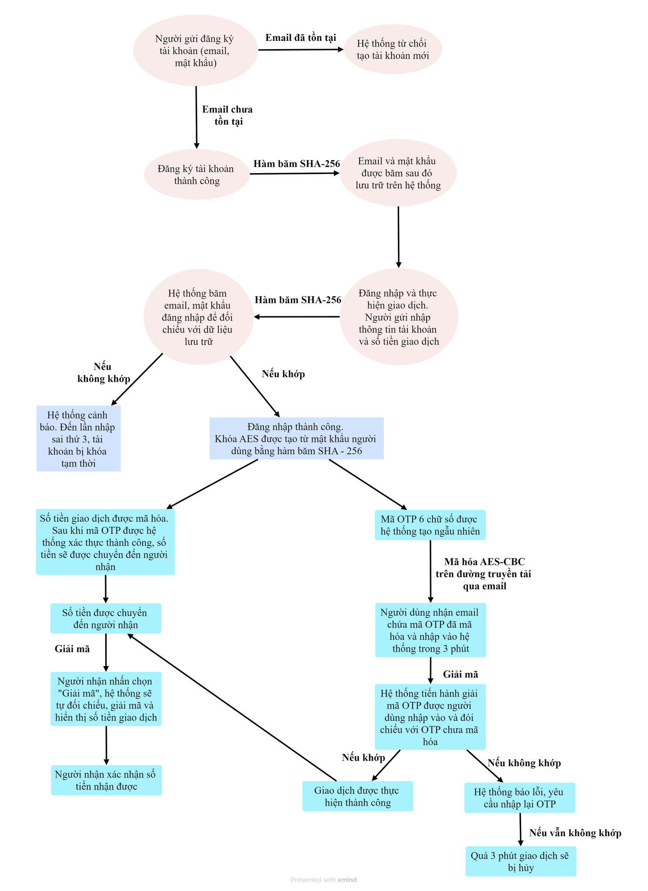

# AES-OTP Secure Transaction App


A Python Tkinter desktop application that simulates a secure electronic transaction system using **AES encryption** and **OTP-based two-factor authentication (2FA)**.

---

## Table of Contents
- [Overview](#overview)
- [Features](#features)
- [Installation](#installation)
- [Quick Start](#quick-start)
- [Security Design](#security-design)
- [Secure Transaction Workflow](#secure-transaction-workflow)

---

## Overview

This project demonstrates a basic secure transaction workflow:
1. User registers → credentials are hashed with SHA-256.
2. Transaction amount is encrypted using AES (CBC mode).
3. An OTP is generated, encrypted, and sent via email.
4. User verifies OTP within 180 seconds to confirm the transaction.

---

## Features
- SHA-256 hashing for email & password storage
- AES encryption (CBC mode) for transaction amount
- OTP generation + email delivery (SMTP)
- 180-second countdown timer (OTP expiration)
- Lock after 3 failed login attempts
- Sender/Receiver GUI tabs in Tkinter

---

## Installation

Install dependencies:

```bash
pip install -r requirements.txt
```

---

## Quick Start
1) Set environment variables (Windows CMD)

```bash
set SENDER_EMAIL=your_email@gmail.com
set SENDER_PASSWORD=your_app_password
```
2) Run the app
```bash
python main.py
```

---

## Security Design
1. Credential Protection

User email and password are hashed using SHA-256

No plaintext credentials are stored

2. Transaction Encryption

Transaction amount is encrypted using AES (CBC mode)

Encryption key is derived from SHA-256(password)

A random IV (Initialization Vector) is generated for each encryption

3. OTP Verification

6-digit OTP generated randomly

OTP encrypted using AES before being sent via email

OTP expires after 180 seconds

Maximum 3 failed attempts allowed

---

## Secure Transaction Workflow


